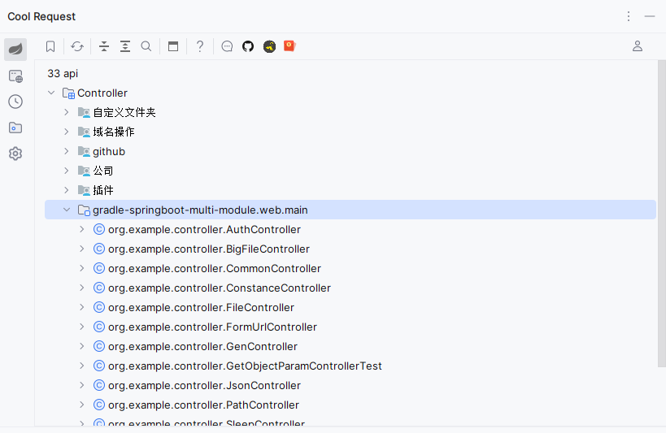
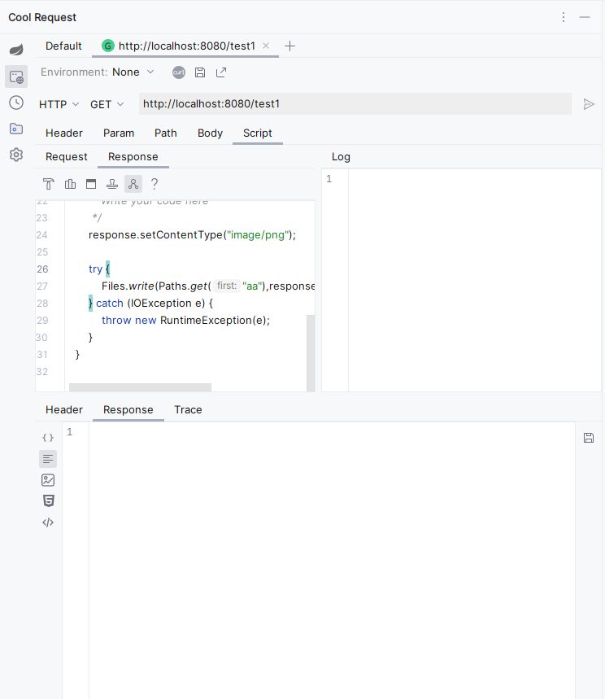
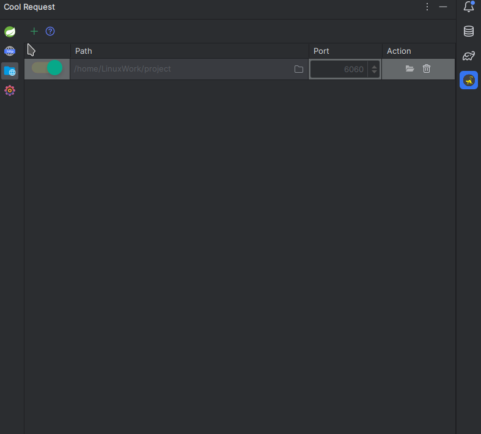
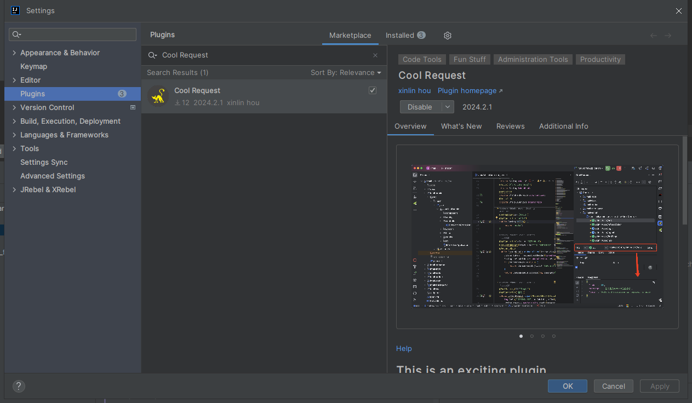

<div align="center">
  <h1 align="center">
    Cool Request
    <br />
    <br />
    <a href="https://plugin.houxinlin.com">
      
    </a>
  </h1>
</div>

This plugin is used for debugging HTTP interfaces and schedulers in IntelliJ IDEA.

[中文](README.zh.md)

[Documentation](https://plugin.houxinlin.com)
# Screenshots
1. Api
   
2. Request
   
3. Static Server
  


# Usage Steps:
1. Go to Setting->Plugins, search for Cool Request, and click install.



## Features
- ✓️ Collect and display all Controller information defined in Spring Boot, supporting HTTP/reflection calls.
- ✓ Collect and display timers defined in Spring Boot; you can manually trigger them without waiting for a specified time.
- ✓ Optionally bypass interceptors during the request.
- ✓ Optionally specify proxy/original objects during the request.
- ✓ One-click export to OpenAPI format.
- ✓ One-click import to Apifox.
- ✓ Copy requests as curl commands.
- ✓ Compatible with Gradle, Maven multi-module projects.
- ✓ Compatible with Java/Kotlin languages.
- ✓ Powerful HTTP request parameter guessing feature to reduce the time developers spend on key entry.
- ✓ Write scripts for pre/post request using Java syntax.
- ✓ Save response results to a file.
- ✓ Quickly preview JSON, XML, images, HTML, and text responses.
- ✓ Multiple layout switching options.
- ✓ Automatically discover Spring Gateway paths.
- ✓ Multi-environment configuration.
-
## Issues

1. What are proxy objects and original objects?

   Answer: This plugin does not call the Controller through HTTP requests but uses reflection internally. Therefore, when obtaining an object, the object may be CGLIB proxied, but you can choose the original object. However, some AOP may be disabled in this process.

2. What are interceptors?

   If your project has an interceptor that matches the Controller, when selecting to apply the interceptor, it will be called first if it matches the Controller. If no interceptor is selected, even if the interceptor matches the Controller, it will not be called. This is one of the original intentions of this plugin, which is used to debug Controllers without authentication.

## Build Original Code

```cmd
./gradlew buildPlugin
```
```
2. Open Plugin Setting
3. Install Plugin For Disk
4. Select ./build/distributions/cool-request-plugin.zip

```

## Star History

[](https://star-history.com/#houxinlin/cool-request&Date)

