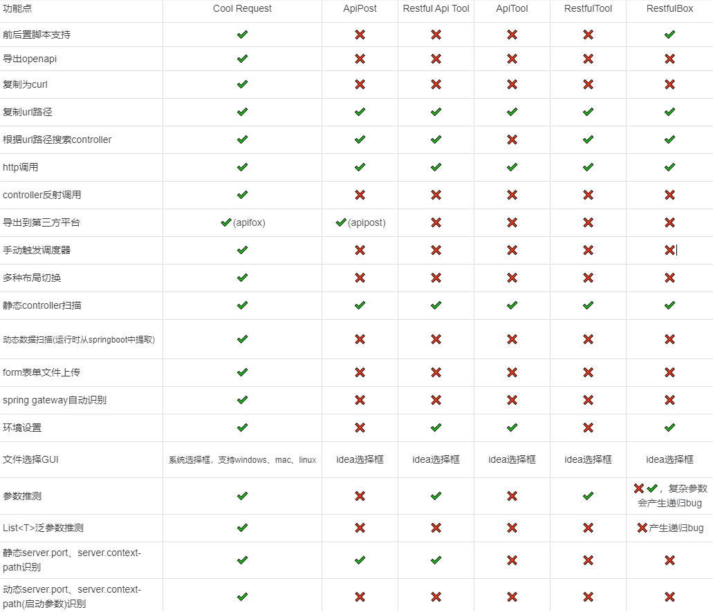

<div align="center">
  <h1 align="center">
    Cool Request
    <br />
    <br />
    <a href="https://coolrequest.dev">
      
    </a>
  </h1>
</div>

此插件用于在IDEA中调试HTTP接口，调度器。

[文档](https://coolrequest.dev)
# 截图
1. Api
   
   

2. Request
   
   

3. 创建静态服务器
   
   

# 同类型插件对比



# 使用步骤：
1. Setting->Plugins中搜索Cool Request，点击install.


## 特性
- ✓️ 收集并展示Spring Boot中定义的所有Controller信息，支持HTTP/反射调用
- ✓ 收集并展示Spring Boot中定义的定时器，可手动触发而无需等待指定时间
- ✓ 请求期间可选择绕过拦截器
- ✓ 在请求期间可选择指定代理/原始对象
- ✓ 一键导出为OpenAPI格式
- ✓ 一键导入到Apifox
- ✓ 复制请求为curl
- ✓ 与Gradle、Maven多模块项目兼容
- ✓ 与Java/Kotlin语言兼容
- ✓ 强大的HTTP请求参数推测功能，减少开发者填写key的时间
- ✓ 使用Java语法编写请求前/请求后的脚本
- ✓ 将响应结果保存到文件
- ✓ 快速预览JSON、XML、图片、HTML、文本响应
- ✓ 多种布局切换
- ✓ Spring Gateway网关路径自动发现
- ✓ 多环境配置
- 
## 问题

1. 什么是代理对象和原始对象？

   答：该插件不通过HTTP请求调用Controller，而是通过反射在内部调用。因此，在获取对象时，对象可能被CGLIB代理，但你可以选择原始对象，但某些AOP可能在这个过程中失效。

2. 什么是拦截器？

   如果你的项目有一个拦截器与该Controller匹配，在选择应用拦截器时，该拦截器将首先被调用。如果未选择拦截器，即使拦截器匹配该Controller，也不会被调用。这是该插件诞生的初衷之一，用于在没有身份验证时调试Controller。


## 构建原代码

```cmd
./gradlew buildPlugin
```
### Install
    2. Open Plugin Setting
    3. Install Plugin For Disk
    4. Select ./build/distributions/cool-request-plugin.zip
