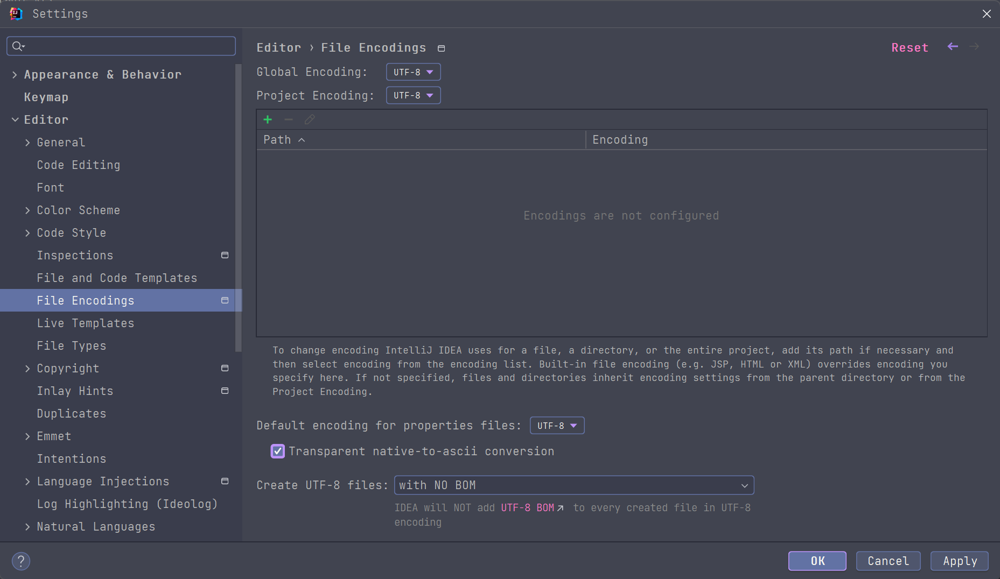

# 开发指南

## 工具版本

JDK 11

Gradle 7.5

## 项目结构

```
├─action                        操作按钮
│  ├─actions                    按钮显示
│  ├─copy                       复制类名, curl 命令等
│  ├─export                     导出
│  └─response                   响应
├─bean
│  └─components
│      ├─controller
│      └─scheduled
├─cache                         缓存
├─cool
│  └─request
├─export
├─invoke
├─listener                      监听器
├─model
│  └─pack
├─net
│  └─request
├─openapi
├─plugin                        插件
│  └─apifox
├─scans
│  ├─controller
│  └─scheduled
├─script
├─springmvc
│  ├─config
│  │  ├─base
│  │  └─reader
│  ├─param
│  └─utils
├─state
│  └─project
├─tool
├─utils
│  ├─exception
│  ├─file
│  └─service
└─view                          视图
    ├─dialog                    弹窗
    ├─events                    事件
    ├─main                      主界面
    └─page                      页面
        └─cell                  单元格
```

## 运行与构建

### 初始化项目

windwos
```powershell
./gradlew.bat 
```

linux/macos
```shell
./gradlew
```

### 运行项目（直接打开安装编译后插件的 IDEA）

#### 终端命令方式
windwos
```powershell
./gradlew.bat runIde
```

linux/macos
```shell
./gradlew runIde
```
#### idea 中使用 jrebel 启动


## 关于资源或其他文件乱码

